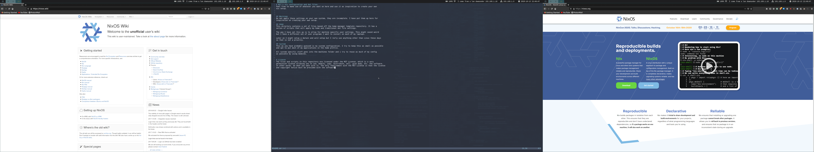

# What is this?
This is my collection of dotfiles which I use to build my Linux systems and 
control how they are configured.



For more information on NixOS (the Linux distribution) and nix (the
packaging tool and language that most of this repository is written in) go to
https://nixos.org/. For learning more about nix concepts in general, I **highly
recommend** you take a look through https://zero-to-nix.com/.

# Folder structure

```
|-[lib]     -- Contains utility functions.
|-[modules] -- Contains all the NixOS modules that make up this configuration.
|-[pkgs]    -- Contains custom nix packages.
|-[secrets] -- Contains encrypted secrets that are decrypted during install via `sops-nix`.
|-flake.nix -- Contains the main nix flake.
|-shell.nix -- Creates a nix shell with required tools to install.
```

# Install
If you have an existing NixOS system, it's possible to switch over to this nix
config with the following commands. Clone or download this repo, and run them
from the root of your checkout:

```shell
nix-shell  # enter a shell with all required build tools installed.
sudo nixos-rebuild switch --flake .#NAME_OF_SYSTEM  # install this configuration.
```

Replace `NAME_OF_SYSTEM` with the name of the system configuration you want
(such as `izzy`) to install. The currently defined system names are:

Personal devices:

- `izzy` - My Framework 10th gen intel laptop.
- `moonbow` - My desktop.

Server infrastructure (runs various services):

- `plonkie`

# Update

To update a system, update the pinned flake input revisions in `flake.lock`, and rebuild the system:

```shell
nix flake update  # update flake.lock
sudo nixos-rebuild switch --flake .#NAME_OF_SYSTEM  # install the configuration with the updated inputs
```

Assuming your system functions as intended, you should then commit the updated
`flake.lock` file.

If things go wrong, revert the changes to `flake.lock` and run `nixos-rebuild`
again. If things go *really wrong*, just reboot and select the last-known good
nixos profile from the list (a new profile is created every time you run
`nixos-rebuild`).

# Deploy

It is possible to deploy a system configuration defined in this repo to a remote
machine over SSH (such as a remote server or another personal device). This repo
makes use of [deploy-rs](https://github.com/serokell/deploy-rs/) to do so.

First, make sure you can actually SSH into the remote machine, either through an
SSH public key or a password.

Then, ensure that all of the following:

- the remote IP address or domain that you want to deploy to,
- the name of the user to SSH in as (this user needs to be able to run
`nixos-rebuild`),
- the name of the system configuration to use,

are all defined under a `deploy.nodes.NAME_OF_SYSTEM` option at the bottom of
[flake.nix](flake.nix). All possible options are defined
[here](https://github.com/serokell/deploy-rs#generic-options)

Now it's time to deploy! Enter the nix shell of this repo (which has `deploy-rs`
installed) and deploy your desired system name.

```shell
nix-shell  # enter this repo's nix shell
deploy .#NAME_OF_SYSTEM
```

Omitting `.#NAME_OF_SYSTEM` will instead deploy an updated configuration to all
configured hosts! Checks can be skipped with `--skip-checks` to speed up rapid
iteration.

# Secrets Management

Secrets are managed through [sops-nix](https://github.com/Mic92/sops-nix), which
itself uses Mozilla [sops](https://github.com/getsops/sops) to do the actual
encryption/decryption. Note that encrypting/decrypting secrets using a private
key stored on a YubiKey is [currently not
supported](https://github.com/Mic92/ssh-to-age/issues/35).

Files with encrypted secrets are stored under `secrets/NAME_OF_SYSTEM` for a
single hosts or `secrets/personal_common` for secrets that are used across all
of my personal devices. These files are encrypted with `sops` and then committed
to the repo.

Key configuration (which public keys to encrypt to) are stored in
[.sops.yaml](.sops.yaml). `sops` will store metadata about which keys a specific
file was encrypted to inside the file itself, under a `sops` top-level key. As
such, `sops` only supports encrypting secrets in certain filetypes (currently
YAML, JSON, ENV, INI and BINARY). If you add a new key to the setup, any files
it will need to decrypt must be re-encrypted by `sops` using `sops updatekeys
path/to/file`.

The limitation of this system is that you can only encrypt a whole file, and the
software you are configuring needs to be able to read secrets from a file
(rather than i.e. a string from the environment).

## Create a new secret

First, ensure the appropriate public key fingerprints exist in `.sops.yaml`.
They are organised by users and hosts. All of my personal devices share the same
user key, while each remote host has its own. Note that this file also contains
rules for directory path regexes and which keys should be encrypted to depending
on the filepath.

Create a configuration file for your program under
`secrets/{NAME_OF_SYSTEM,personal_common}` with your secrets in them.

Encrypt the file using `sops`. `sops` is already installed inside the nix shell
of this repo, so there's no need to install it manually:

```shell
sops -i secrets/personal_common/my_secret_file.yaml
```

Now reference this file in your nix configuration. First you need to tell
`sops-nix` about the file (and that it should be decrypted upon system
activation) by adding it to `sops.secrets` (see [an
example](https://github.com/anoadragon453/dotfiles/blob/41595bdef037d1a17c016d4279e8404868de140f/flake.nix#L366-L372)).
Then provide the file to whatever service or program you're configuring (see [an
example](https://github.com/anoadragon453/dotfiles/blob/41595bdef037d1a17c016d4279e8404868de140f/modules/server/vaultwarden.nix#L52)). As
mentioned earlier, the service needs to be able to accept a file containing
configuration values.


# License
All content in this repo is released under a [CC0 Public Domain License](LICENSE).

Which means you are free to do whatever you wish with the code without any
requirement of attribution.
